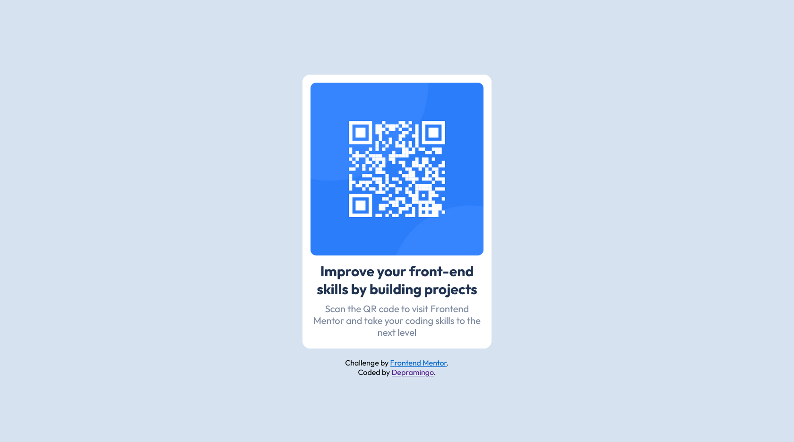

# Frontend Mentor - QR code component solution

This is a solution to the [QR code component challenge on Frontend Mentor](https://www.frontendmentor.io/challenges/qr-code-component-iux_sIO_H). Frontend Mentor challenges help you improve your coding skills by building realistic projects.

## Table of contents

-   [Overview](#overview)
    -   [Screenshot](#screenshot)
    -   [Links](#links)
-   [My process](#my-process)
    -   [Built with](#built-with)
    -   [What I learned](#what-i-learned)
    -   [Continued development](#continued-development)
    -   [Useful resources](#useful-resources)
-   [Author](#author)
-   [Acknowledgments](#acknowledgments)

**Note: Delete this note and update the table of contents based on what sections you keep.**

## Overview

-   A Frontend Mentor project to replicate a given design of a QR code graphic with only CSS and HTML.

### Screenshot



### Links

-   Solution URL: [solution](https://www.frontendmentor.io/solutions/qr-code-component-WTpyl6tJ23)
-   Live Site URL: [live site](https://depramingo.github.io/qr-code-component/)

## My process

### Built with

-   Semantic HTML5 markup
-   CSS
-   Flexbox
-   Mobile-first workflow

### What I learned

-   This was my first "actual" project ever, I mean one where I understood every single line of code I wrote, I wasn't scared or anxious. I didn't freeze. I just kept on going and whenever I encountered an issue, I just looked for the solution. And whenever I encountered something new, I just learned it.

-   I learned Git & Github.. yes, I didn't know how to use them before I started this project, had them for a while tho.
-   I learned how to add icons in the HTML file:

```html
<link rel="icon" href="./images/favicon-32x32.png" type="image/png" />
```

-   learned a lot of CSS:

```css
.all-these {
    box-sizing: border-box, content-box;
    max-width: 100%;
    min-height: 100vh;
    transition: all 0.2s ease-in-out;
    transform: scale(1.01);
}
```

-   learned about CSS cubic-bezier as well.. but didn't use it here
-   Learned CSS @media queries as well

### Continued development

-   CSS cubic-bezier function
-   CSS transition & transform properties

## Author

-   Frontend Mentor - [@Depramingo](https://www.frontendmentor.io/profile/Depramingo)

## Acknowledgments

-   Shout out to [Matt V.](https://github.com/mv805), his [solution](https://github.com/mv805/QR-Code-challenge) helped me write my own and made the process SO MUCH easier.
-   Thank you to [Senofy, Mando Ben, blinkbat, Kwoka, Doug.. and more] from the "Web dev and web design" discord server, who helped me with this, they answered the sheer amount of questions I had, gave me advice, and helped me understand so many things, I can't thank them enough.
